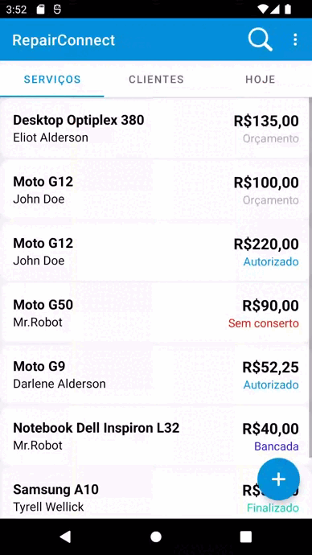
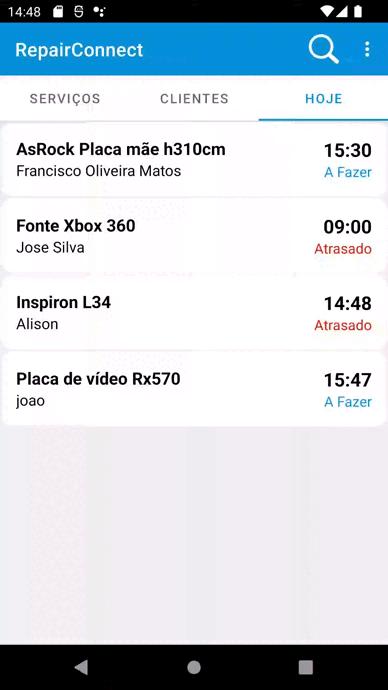
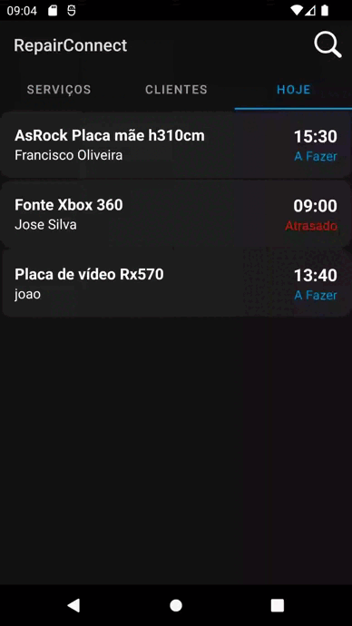

# RepairConnect-Public
RepairConnect é um aplicativo Android desenvolvido para gerenciamento de ordens de serviço em assistências técnicas. É uma aplicação totalmente online, não armazena nenhum registro localmente no aparelho e mantém registros independentes para cada usuário. O aplicativo oferece funções de gerenciamento para usuários administradores e foi construído utilizando a linguagem Java nativa para Android, com integração a uma API proprietária desenvolvida em Java, utilizando o Framework Spring.

## Principais recursos:
- Registro de Imagens do Serviço: Os usuários podem adicionar imagens relevantes durante o processo de gerenciamento das ordens de serviço, fornecendo informações visuais adicionais.
- Página Web de Consulta para o Cliente: Os clientes têm acesso a uma página web dedicada para consulta de suas ordens de serviço, o que facilita a interação e a obtenção de informações sobre o andamento dos serviços.
 - Aba de Serviços do Dia: Uma seção dedicada exibe todos os serviços agendados para o dia atual, proporcionando uma visão rápida das atividades programadas.

O RepairConnect-Public visa proporcionar uma experiência intuitiva e eficiente no gerenciamento de ordens de serviço, garantindo a segurança dos dados por meio do armazenamento na nuvem e fornecendo aos usuários ferramentas valiosas para melhor administrar e acompanhar suas atividades diária

## Projeto 
- [Interface](#interface)
- [Registro de Serviços e Clientes](#registro-de-serviços-e-clientes)
- [Funções](#funções)
- [Usuário Administrador e Consulta Web](#usuário-administrador-e-consulta-web)

### Insterface


### Registro de Serviços e Clientes



### Funções



### Usuário Administrador e Consulta Web



Download da versão de demonstração gratuita: http://repairconnect.duckdns.org/RepairCon.apk
#### Credenciais para uso:
```
  Usuário Administrador: admin
  Senha: main123

  Usuário padrão: user
  Senha: main123
```
## (Código Fonte Privado)
Caso tenha interesse no projeto, seja para implementação ou colaboração por favor contatar
- Linkedin: https://www.linkedin.com/in/luiz-paulo-lopes-15b5191a8/
- Telegram/Whatsapp:(88) 9 9378-8464

###### (by SingleSoft)
